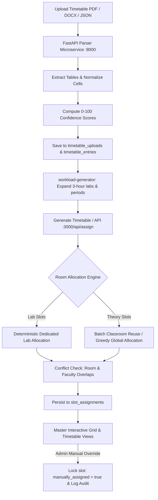

# TT-FOP: Timetable & Room Assignment System — Project Context & Architecture

> **Master Architecture Reference Document**  
> *This document serves as the single source of truth for the TT-FOP project architecture, system design, data models, business logic, workflows, roadmap, and operational guidelines for AI agents and developers.*

---

## 1. Project Overview & Domain Scope

### 1.1 Objective
The **TT-FOP** (Faculty of Pharmacy Timetable Management System) is an automated timetable parsing, room allocation, and schedule management platform designed for the **Faculty of Pharmacy (FOP), Parul University**.

### 1.2 Core Problem
Department timetables (uploaded as PDFs, DOCX, JSON, or TXT) specify course, semester, division, day, time, subject, and faculty for each period—but **lack physical room assignments**. Multiple academic programs and divisions run simultaneously, competing for a finite pool of shared lecture classrooms and specialized laboratory facilities. 

The system solves this by:
1. Ingesting and parsing structured academic timetables from raw documents.
2. Ingesting and managing room inventories with strict category specializations (labs vs. classrooms).
3. Globally allocating physical rooms to time slots without double-booking or room-capacity violations.
4. Detecting faculty scheduling clashes (e.g., one faculty assigned to two parallel sessions).
5. Providing an interactive timetable grid with manual overrides, conflict highlighting, and audit logging.

### 1.3 Academic Programs & Department Structure
| Program | Academic Cycle | Duration | Divisions / Batches | Class Types | Active Target |
|---|---|---|---|---|---|
| **B.Pharm** (Bachelor of Pharmacy) | Semester-based | 4 Years (8 Sems) | 2 Divisions/Year (Div A, Div B)<br>Batches: Div A &rarr; `[A, B]`, Div B &rarr; `[C, D]` | Theory (1 hr), Practical (3 hrs) | Semesters 1, 3, 5, 7 (Odd) & 2, 4, 6, 8 (Even) |
| **M.Pharm** (Master of Pharmacy) | Semester-based | 2 Years (4 Sems) | 9 Canonical Specializations (1 batch each, max 15 students) | Theory (1 hr), Practical (3 hrs) | Semesters 1, 3 |
| **Pharm D** (Doctor of Pharmacy) | Annual (Year-based) | 5 Years | 5 Batches (1 per year, Year 1 to 5, max 40 students) | Theory (1 hr), Practical (3 hrs) | Annual batches |

#### M.Pharm 9 Canonical Specializations:
1. Pharmaceutics (`ceutics`)
2. Pharmaceutical Chemistry (`chemistry`)
3. Pharmacology (`cology`)
4. Pharmacognosy (`cognosy`)
5. Phytopharmacy and Phytomedicine (`Phyto`)
6. Pharmaceutical Technology (`Techno`)
7. Quality Assurance (`QA`)
8. Regulatory Affairs (`RA`)
9. Pharmacy Practice (`PP`)

---

## 2. Technology Stack

| Layer | Technologies / Libraries | Role & Notes |
|---|---|---|
| **Frontend Framework** | Next.js 16 (App Router), React 19 | Server & Client components, dynamic routing, reactive UI state |
| **Styling & Design** | Tailwind CSS, Modern CSS variables | Glassmorphic, dark/light theme responsive dashboard UI |
| **Primary Backend / API** | Next.js API Routes (`app/api/`) | REST API handling assignment triggers, slot CRUD, room management, and statistics |
| **Parser Microservice** | Python 3.12+, FastAPI, Uvicorn, `pdfplumber`, `python-docx` | Document table extraction, cell mapping, time normalizer, parsing confidence score |
| **Database & Auth** | Supabase (PostgreSQL 15+, Supabase Auth, Row Level Security) | Relational database, transactional RPCs, document storage buckets |
| **Dev & Deployment** | PowerShell (`start-dev.ps1`), Docker (`docker-compose.yml`), Render (`render.yaml`) | Multi-service local runner & cloud container deployments |

---

## 3. Repository Architecture & Directory Map

```
TT_FOP/
├── PROJECT_CONTEXT.md             # << THIS DOCUMENT (Master reference)
├── README.md                      # Academic department structure & batch overview
├── tt-plan.md                     # Original product planning specification
├── room_assignment_fix_prompt.md  # Architectural prompt for global room allocation
├── start-dev.ps1                  # PowerShell script to run Next.js & Python parser concurrently
├── docker-compose.yml             # Docker config for the Python parser service
├── render.yaml                    # Render cloud deployment blueprint
│
├── parser-service/                # ── PYTHON PARSER MICROSERVICE (Port 8000) ──
│   ├── main.py                    # FastAPI entry point (/parse-timetable, /health) + fallback HTTP server
│   ├── requirements.txt           # Python dependencies (fastapi, uvicorn, pdfplumber, python-docx, etc.)
│   ├── Dockerfile                 # Container definition for parser service
│   ├── test_parser.py             # Parser test suite
│   └── parsers/
│       ├── __init__.py
│       ├── docx_parser.py         # Word (.docx) table & XML cell parsing
│       ├── pdf_parser.py          # PDF table detection via pdfplumber (stream & lattice modes)
│       └── mapper.py              # Slot content tokenization, batch mapping, period time mapper
│
└── tt-fop-app/                    # ── NEXT.JS WEB APPLICATION (Port 3000) ──
    ├── package.json               # Node dependencies (@supabase/ssr, @supabase/supabase-js, next, react)
    ├── next.config.mjs            # Next.js configuration
    ├── Dockerfile                 # Production Next.js Dockerfile
    ├── .env.local                 # Supabase and Parser service connection credentials
    ├── scripts/
    │   └── seed-data.mjs          # Database seeding script for rooms, faculties, and subjects
    ├── supabase/
    │   └── migrations/
    │       ├── 001_initial_schema.sql             # Base schema (rooms, faculties, subjects, slot_assignments)
    │       ├── 002_timetable_uploads_schema.sql   # Raw upload storage & parsed timetable_entries
    │       └── 003_parsing_score_columns.sql      # Confidence scoring columns
    │
    └── app/
        ├── layout.js              # Root layout with providers & fonts
        ├── providers.js           # Context providers wrapper
        ├── globals.css            # Custom CSS utilities & design variables
        ├── (auth)/                # Authenticated Application Views
        │   ├── layout.js          # Shared dashboard shell with Sidebar navigation
        │   ├── dashboard/page.js  # Upload summary, quick statistics, system status
        │   ├── upload/page.js     # Timetable document upload & real-time parsing progress
        │   ├── generate/page.js   # Multi-program global room allocation runner & preview
        │   ├── assignment/page.js # Interactive master schedule grid, slot editing modal, room picker
        │   ├── timetable/page.js  # Division/semester timetable viewer & printer
        │   └── rooms/page.js      # Room inventory management & category configuration
        │
        ├── api/                   # API Endpoints
        │   ├── assign/route.js    # Global / scoped room assignment engine & conflict solver
        │   ├── slots/route.js     # Query slots with filters, update slot room assignments
        │   ├── slots/options/route.js # Metadata options (programs, semesters, divisions)
        │   ├── rooms/route.js     # Room CRUD endpoints
        │   ├── faculties/route.js # Faculty list & workload tracking
        │   ├── subjects/route.js  # Subject registry & room requirements
        │   ├── schedules/route.js # Schedule definitions handler
        │   └── stats/route.js     # Dashboard metrics & conflict count aggregations
        │
        ├── components/
        │   └── Sidebar.js         # Navigation sidebar component
        │
        ├── context/
        │   └── UploadTrackerContext.js # Global state for file upload tracking & background parsing
        │
        └── lib/
            ├── supabase.js            # Browser-side Supabase client (`createBrowserClient`)
            ├── supabase-server.js     # Server-side Supabase client (`createServerClient`)
            ├── room-allocation-map.js # Deterministic classroom & lab mappings per program/semester/division
            └── workload-generator.js  # Schedule expander (expands multi-hour practical periods & slots)
```

---

## 4. Database Schema (Supabase PostgreSQL)

### 4.1 Core Entity Tables
1. **`rooms`**
   - `id` (UUID, PK): Unique room ID.
   - `room_no` (TEXT, UNIQUE): Human-readable room identifier (e.g. `'303'`, `'401 A'`).
   - `room_name` (TEXT): Descriptive name (e.g. `'Pharmaceutics Lab 1'`).
   - `category` (TEXT): Purpose tag (`'general'`, `'lab'`, `'pharmacy_practice_lab'`, etc.).
   - `program` (TEXT): Target program affinity (`'B.Pharm'`, `'M.Pharm'`, `'Pharm D'`).
   - `capacity` (INT): Static sanity capacity threshold (e.g. 15 for labs, 60 for classrooms).
   - `is_active` (BOOLEAN): Availability flag.

2. **`faculties`**
   - `id` (UUID, PK)
   - `name` (TEXT, UNIQUE): Full faculty name or canonical acronym.
   - `is_active` (BOOLEAN)

3. **`subjects`**
   - `id` (UUID, PK)
   - `subject_code` (TEXT): Course code (e.g. `'BP101T'`).
   - `subject_name` (TEXT): Full name (e.g. `'Human Anatomy and Physiology I'`).
   - `program` (TEXT): `'B.Pharm'`, `'M.Pharm'`, `'Pharm D'`.
   - `specialization` (TEXT): Specialization for M.Pharm (or NULL).
   - `semester` (INT): Target semester number (or year for Pharm D).
   - `class_type` (TEXT): `'theory'`, `'practical'`, or `'self_study'`.

4. **`subject_room_requirements`**
   - `id` (UUID, PK)
   - `subject_id` (UUID, FK &rarr; `subjects.id`): Subject link.
   - `required_category` (TEXT): Mandatory room category for classes of this subject.

### 4.2 Timetable Ingestion & Execution Tables
5. **`timetable_uploads`**
   - `id` (UUID, PK)
   - `file_path` (TEXT): Storage path in Supabase Storage (`timetables` bucket).
   - `original_filename` (TEXT)
   - `program` (TEXT), `semester` (INT), `division` (TEXT)
   - `status` (TEXT): `'pending'`, `'parsed'`, `'failed'`.
   - `overall_parsing_score` (NUMERIC): Average confidence score across all entries (0–100).

6. **`timetable_entries`** *(Raw parsed schedule items)*
   - `id` (UUID, PK)
   - `upload_id` (UUID, FK &rarr; `timetable_uploads.id` ON DELETE CASCADE)
   - `day` (TEXT): Day of week (`'Monday'` to `'Saturday'`).
   - `period` (INT): Period index (0 to 5).
   - `start_time` (TIME), `end_time` (TIME)
   - `subject` (TEXT), `subject_code` (TEXT)
   - `class_type` (TEXT): `'theory'`, `'practical'`, `'self_study'`.
   - `batch` (TEXT): Specific batch (e.g. `'A'`, `'B'`, `'ALL'`).
   - `faculty` (TEXT), `room` (TEXT)
   - `parsing_score` (NUMERIC): Entry-level extraction confidence score (0–100).

7. **`slot_assignments`** *(Active room assignment operational table)*
   - `id` (UUID, PK)
   - `division` (TEXT), `batch` (TEXT), `semester` (INT), `program` (TEXT)
   - `day` (TEXT), `start_time` (TIME), `end_time` (TIME)
   - `subject` (TEXT), `faculty` (TEXT)
   - `room_id` (UUID, FK &rarr; `rooms.id`, NULLABLE until assigned)
   - `manually_assigned` (BOOLEAN DEFAULT false): Lock flag protecting admin overrides from being overwritten by algorithm runs.

8. **`assignment_history`** *(Audit trail)*
   - `id` (UUID, PK)
   - `slot_assignment_id` (UUID, FK &rarr; `slot_assignments.id`)
   - `previous_room_id` (UUID, FK &rarr; `rooms.id`)
   - `new_room_id` (UUID, FK &rarr; `rooms.id`)
   - `changed_by` (UUID, FK &rarr; `auth.users.id`)
   - `changed_at` (TIMESTAMPTZ DEFAULT now())
   - `change_type` (TEXT): `'algorithm'` or `'manual'`

---

## 5. End-to-End Processing Workflow



### 5.1 Document Ingestion & Confidence Scoring
- Document uploaded from frontend &rarr; forwarded to Python parser service (`/parse-timetable`).
- Extraction engine determines table layout:
  - `pdf_parser.py`: Uses `pdfplumber` with table edge detection and word bounding boxes.
  - `docx_parser.py`: Iterates `docx.table` elements and cell XML nodes.
  - `mapper.py`: Deconstructs multi-line cells (e.g. subject + faculty + room combinations), recognizes self-study/recess/remedial patterns, and assigns period timings.
- **Confidence Scoring Equation (0–100 points)**:
  - Subject present (&ge; 2 chars): +25 pts
  - Faculty present (&ge; 2 chars): +25 pts
  - Day is valid weekday: +10 pts
  - Start & End times valid: +10 pts
  - Room parsed (optional): +10 pts
  - Batch specified: +5 pts
  - Subject code valid: +5 pts
  - Class type valid: +5 pts
  - Period valid (0–5): +5 pts

### 5.2 Room Assignment & Conflict Rules
1. **Lab Priority & Immutability ("Labs are Sacred")**:
   - Practical classes run for **3 continuous hours** (e.g. 13:30–16:25 or 09:30–12:30).
   - Lab assignments are constrained by subject specialization and lab capacity. They are assigned first and must NEVER be displaced by theory classes.
2. **Theory Classroom Reuse**:
   - Theory classes for a given semester & division are mapped to their assigned home classroom (e.g., B.Pharm Sem 1 Div A &rarr; Room 404, Div B &rarr; Room 407).
3. **Time Overlap Condition**:
   - Time slots can start/end at non-standard boundaries. Two slots conflict if they share the same physical room or faculty AND satisfy:
   $$\text{Start}_A < \text{End}_B \quad \text{AND} \quad \text{Start}_B < \text{End}_A$$
4. **Faculty Clash Prevention**:
   - A single faculty member cannot be scheduled for overlapping slots across multiple divisions or programs.
5. **Locking & Override Safety**:
   - When an administrator manually sets a room in the UI, `manually_assigned` is set to `true`.
   - Algorithm runs (full or incremental) strictly filter for `WHERE manually_assigned = false AND room_id IS NULL` (or re-evaluates unassigned/unlocked slots only).

---

## 6. Development & Operational Guide

### 6.1 Environment Variables
Create `.env.local` inside `tt-fop-app/`:
```env
NEXT_PUBLIC_SUPABASE_URL=https://your-project.supabase.co
NEXT_PUBLIC_SUPABASE_ANON_KEY=your-anon-key
SUPABASE_SERVICE_ROLE_KEY=your-service-role-key
PARSER_SERVICE_URL=http://localhost:8000
```

### 6.2 Running Locally
Run both the Python parser service and the Next.js development server simultaneously using the root launcher:
```powershell
# From workspace root
.\start-dev.ps1
```
*Alternatively, run separately:*
```powershell
# Terminal 1: Parser Microservice
cd parser-service
.\venv\Scripts\activate
python main.py

# Terminal 2: Next.js App
cd tt-fop-app
npm run dev
```

### 6.3 Database Migrations & Seeding
1. Execute SQL migration scripts in Supabase Dashboard (SQL Editor) in sequence:
   - `001_initial_schema.sql`
   - `002_timetable_uploads_schema.sql`
   - `003_parsing_score_columns.sql`
2. Create public Supabase Storage bucket: `timetables`
3. Optional: Seed initial baseline data:
   ```bash
   cd tt-fop-app
   npm run seed
   ```

---

## 7. Strict Rules for AI Coding Assistants

When modifying this repository, any model or human developer **MUST** adhere to the following architecture-specific rules:

1. **Service Boundary Integrity**:
   - Keep document parsing logic (PDF / DOCX table parsing) inside `parser-service/`.
   - Keep room allocation, database interactions, business validation, and UI inside `tt-fop-app/`.
   - Never introduce heavyweight Python libraries into Next.js or Node table extraction hacks into the Next.js server.
2. **Schema & Migration Discipline**:
   - Never alter live Supabase schemas directly without creating a versioned SQL file under `tt-fop-app/supabase/migrations/` (e.g. `004_*.sql`).
   - Maintain backward compatibility for existing columns in `slot_assignments`, `timetable_entries`, and `rooms`.
3. **Respect Immutable Room Logic**:
   - Never allow theory classes to be assigned to lab rooms without explicit category matching.
   - Respect `manually_assigned = true` on `slot_assignments`—never overwrite an admin-locked slot during automatic assignment.
4. **Time Conflict Detection Standard**:
   - Always check time intervals using `s1 < e2 && s2 < e1`. Never rely on simple string equality (`day1 == day2 && time1 == time2`) because practical slots span multiple periods.
5. **No Blind Full-Rewrites**:
   - Do not rewrite existing working UI components or API routes. Extend and modularize existing code in `tt-fop-app/app/` and `tt-fop-app/app/lib/`.
6. **Double-Check Utility Locations**:
   - Check `tt-fop-app/app/lib/` before adding new helper utilities (e.g. `room-allocation-map.js`, `workload-generator.js`, `supabase-server.js`).

---

## 8. Roadmap & Architecture Milestones

- [x] **Phase 1: Foundation & Ingestion**
  - Python parser service with dual PDF & DOCX table extraction.
  - Supabase database schema, auth, and storage bucket configuration.
  - Confidence scoring calculation (0–100) per entry.
- [x] **Phase 2: Timetable & Room Mapping**
  - Workload expansion for 3-hour practical sessions.
  - Deterministic room allocation mapping for B.Pharm & M.Pharm.
  - Interactive grid UI with modal room assignment and clash warnings.
- [ ] **Phase 3: Unified Global Assignment Engine** (In Progress)
  - Refactor room assignment from per-batch runs to a single global multi-batch solver.
  - Persistent global occupancy tracking across all academic programs.
  - Support both **Full Generation** (all odd/even semesters) and **Scoped Regeneration** (single division with locked external state).
- [ ] **Phase 4: Export & Analytics**
  - Export master timetable and division schedules to formatted Excel (`.xlsx`) and PDF.
  - Faculty workload analytics and room utilization heatmaps.
